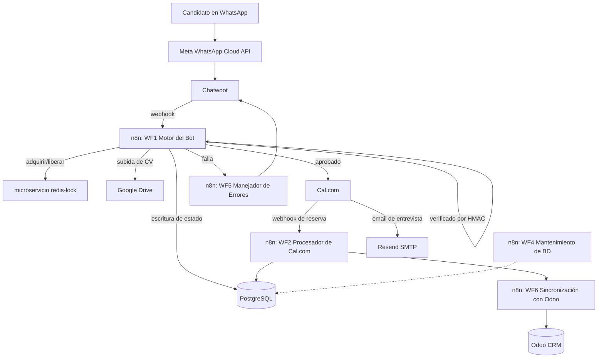

# Bot de Reclutamiento Inmobiliario

Sistema de automatización sobre WhatsApp autohospedado que evalúa, califica y agenda entrevistas para postulantes a agentes inmobiliarios — diseñado, desplegado y operado de punta a punta de forma individual.

[](https://n8n.io)
[](https://flask.palletsprojects.com/)
[](https://www.postgresql.org/)
[](https://www.docker.com/)
[](https://redis.io/)
[](https://www.odoo.com/)

---

## 1. Descripción General del Sistema y Alcance del Proyecto

Este sistema gestiona la primera etapa del proceso de selección para una franquicia inmobiliaria: un candidato envía un mensaje a un número de WhatsApp, atraviesa un flujo de evaluación estructurado y, según sus respuestas, recibe un enlace para agendar una entrevista o es filtrado con una explicación de los motivos.

Fue diseñado, construido y es operado por un único ingeniero: aprovisionamiento de infraestructura, lógica de flujos, dos microservicios personalizados, integración con CRM y endurecimiento en producción. No hay un equipo detrás; cada decisión de diseño representa un balance individual entre velocidad de entrega, carga operativa y mantenibilidad a largo plazo.

**Metodología de trabajo:** cada decisión de arquitectura parte de una especificación explícita — qué problema resuelve, qué alternativas se evaluaron, y por qué se descartaron (ver los ADRs listados más abajo). Ningún cambio se da por completado por descripción: se verifica contra el estado real del sistema en ejecución antes de confirmarlo como resuelto — un patrón documentado explícitamente en más de un ADR de este repositorio, incluyendo un caso donde una salvaguarda se había perdido silenciosamente en una reestructuración posterior y solo se detectó auditando el código real, no la documentación que decía que ya estaba resuelta (ver [ADR-003](docs/adr/ADR-003-message-channel-robustness.md)). Cada cambio pasa por una aprobación explícita antes de aplicarse.

**Qué hace:**
- Ejecuta un flujo de calificación de 12 pasos por WhatsApp (disponibilidad, modelo de comisiones, respaldo financiero, rango de edad, zona geográfica) y genera una calificación determinista de 0 a 3 estrellas.
- Agenda entrevistas mediante Cal.com, generando un enlace único de reserva por cada candidato aprobado.
- Sincroniza a todos los postulantes —aprobados o descartados— en Odoo CRM como registros de `hr.applicant`, con un resumen formateado de su evaluación.
- Deriva la conversación a un reclutador humano a través de Chatwoot cuando el flujo no puede resolver un caso por sí mismo.
- Monitorea su propio estado: mantenimiento programado de la base de datos y un flujo dedicado de manejo de errores que desactiva el bot de forma controlada en lugar de fallar silenciosamente.

**Qué no hace deliberadamente:** usar un LLM en la ruta de calificación. Ver [Principales Desafíos de Ingeniería y Soluciones](#3-principales-desafíos-de-ingeniería-y-soluciones) más adelante.

**Alcance y política de seguridad del repositorio:** Este repositorio expone la arquitectura de ingeniería, los microservicios complementarios y las decisiones de diseño de un sistema activo en producción. Por motivos de seguridad perimetral, reducción de superficie de ataque y confidencialidad comercial, los flujos ejecutables de orquestación (archivos JSON de n8n) y credenciales no forman parte de esta publicación.

---

## 2. Arquitectura



**Desglose de flujos:**

| Flujo | Responsabilidad |
|---|---|
| WF1 | Motor principal del bot: máquina de estados que ejecuta el flujo de evaluación de 12 pasos |
| WF2 | Procesador de webhooks de Cal.com: extrae datos de reserva y actualiza Postgres y Odoo |
| WF4 | Mantenimiento programado y limpieza de la base de datos |
| WF5 | Manejador de errores: desactiva el bot ante fallas, deriva la conversación a un humano y registra la causa |
| WF6 | Sincronización con Odoo CRM: formatea los datos del candidato en registros `hr.applicant` con puntuación y prioridad |

n8n gestiona la lógica de orquestación. Dos componentes residen fuera como servicios independientes debido a que no pertenecen a un motor de flujos: el bloqueo distribuido y la verificación de firmas (detalle a continuación).

---

## 3. Principales Desafíos de Ingeniería y Soluciones

### 3.1 Por qué no usar un LLM en el flujo de calificación

Los criterios de selección en este caso son regulatorios y objetivos, no conversacionales: rangos de edad, conformidad con el esquema de comisiones y elegibilidad geográfica. Incorporar un LLM en ese bucle introduce una probabilidad no nula de interpretar erróneamente o parafrasear una respuesta crítica para el cumplimiento, sin una vía directa para *demostrar* que no lo hizo. Una máquina de estados determinista es auditable por diseño: cada transición corresponde a una condición almacenada y cada puntaje responde a una regla fija. Además, no tiene costo por mensaje ni sufre degradación por desvío de contexto (*prompt drift*). La contrapartida es la rigidez: agregar una nueva pregunta requiere modificar el flujo en lugar de ajustar un prompt. Para este dominio, esa contrapartida es la correcta.

### 3.2 Concurrencia: el problema del mensaje doble en WhatsApp

Los candidatos suelen enviar dos o tres mensajes seguidos en rápida sucesión antes de que el primer webhook termine de procesarse ("Hola", "Quiero postularme", adjunto de CV). Dos webhooks procesados en paralelo para el mismo número telefónico provocaban escrituras duplicadas en la base de datos, respuestas desordenadas del bot y, ocasionalmente, que un candidato reingresara a un paso anterior.

La solución consiste en un microservicio liviano en Flask + Redis (`redis-lock`) que cada transición de estado adquiere antes de escribir y libera inmediatamente después de enviar la respuesta a Meta:

- `POST /acquire` — establece una clave por número telefónico con un TTL de 3 segundos. Si la clave ya existe, la solicitud se rechaza y n8n encola o descarta según corresponda en lugar de competir.
- `POST /release` — elimina la clave en cuanto se confirma la entrega del mensaje saliente.

El TTL es corto y deliberado: suficiente para cubrir un ciclo de mensaje-respuesta y lo bastante breve para que una ejecución interrumpida no bloquee al candidato de forma permanente. No es un bloqueo de nivel distribuido complejo (sin Redlock, instancia única de Redis, sin alta disponibilidad); no lo requiere para este volumen de tráfico. La decisión fue construir la solución más simple que eliminara la condición de carrera, en lugar de una solución teóricamente compleja pensada para una escala innecesaria.

### 3.3 Perímetro Zero-Trust y autenticidad de webhooks

Se abordaron dos problemas de confianza independientes mediante mecanismos específicos:

- **Perímetro:** Los detalles específicos de implementación del perímetro (proveedor, mecanismo de túnel, configuración de firewall) se omiten deliberadamente de esta publicación por razones de seguridad operativa. El patrón general: aislamiento de red interna para todos los servicios, sin superficies administrativas expuestas directamente, con autenticación reforzada en cualquier acceso remoto necesario.
- **Autenticidad de mensajes:** los webhooks entrantes se validan con firmas HMAC-SHA256 a través de un servicio dedicado (`hmac-verifier`), asegurando que cada solicitud provenga de la fuente esperada antes de que n8n la procese. Las llamadas internas entre servicios (n8n → redis-lock) emplean un token de cabecera independiente, evitando la sobrecarga de HMAC en tráfico dentro de la misma red.

Un hook de pre-commit escanea el código para prevenir la inclusión de secretos o credenciales sin anonimizar antes de que lleguen a git.

### 3.4 Desacoplamiento del correo transaccional de una casilla compartida

Originalmente, Cal.com enviaba las confirmaciones de entrevista mediante una cuenta de Gmail por SMTP con OAuth2. Las heurísticas de Google marcaron periódicamente el patrón de envío automatizado desde una IP de centro de datos como actividad sospechosa, provocando bloqueos preventivos y la interrupción silenciosa de las notificaciones —situación detectada de forma reactiva cuando los candidatos informaban no haber recibido confirmación—.

Se migró el correo transaccional a Resend con dominio autenticado mediante DKIM/SPF y la cabecera `Reply-To` dirigida a la casilla del reclutador, garantizando que las respuestas lleguen a un operador humano. Esto aísla la reputación de envío del flujo automatizado de una cuenta de uso personal, abordando la causa raíz del problema.

---

## 4. Pila Tecnológica y Matriz de Integración

| Capa | Tecnología | Rol |
|---|---|---|
| Orquestación | n8n (autohospedado) | Máquina de estados, lógica de negocio y enrutamiento |
| Canal de mensajería | Meta WhatsApp Cloud API + Chatwoot | Entrega de mensajes y derivación a agentes humanos |
| Base de datos | PostgreSQL | Estado de candidatos y registro de mensajes |
| Agendamiento | Cal.com (autohospedado) | Reserva de entrevistas y generación de enlaces únicos |
| CRM | Odoo 17 Community (autohospedado) | Canal de reclutamiento y registros de candidatos |
| Control de concurrencia | Python / Flask / Redis (a medida) | Bloqueo distribuido por candidato |
| Seguridad de webhooks | Python / Flask (a medida) | Verificación de firmas HMAC-SHA256 |
| Correo transaccional | Resend | Confirmación de entrevistas con autenticación DKIM/SPF |
| Almacenamiento de archivos | Google Drive (OAuth2) | Carga y resguardo de CVs de candidatos |
| Infraestructura | Docker | Contenerización y despliegue de servicios |
| Seguridad perimetral | Acceso Zero-Trust | Sin puertos administrativos expuestos directamente |

El patrón de diseño aplicado: utilizar plataformas consolidadas para componentes estándar (mensajería, CRM, agendamiento) y desarrollar código a medida exclusivamente donde las herramientas existentes no resuelven la falla puntual (bloqueo y verificación de firmas).

---

## 5. Esquema de Despliegue y Estructura del Repositorio

```
real-estate-recruitment-bot/
├── README.md                      # Resumen ejecutivo, arquitectura y decisiones de diseño
├── docs/
│   ├── ARCHITECTURE.md            # Desglose del pipeline, modelo de datos y límites operativos
│   └── adr/                       # Registros de Decisiones de Arquitectura (ADR-001 a ADR-006)
│       ├── ADR-001-deterministic-state-machine.md
│       ├── ADR-002-constrained-input-space.md
│       ├── ADR-003-message-channel-robustness.md
│       ├── ADR-004-crm-selection.md
│       ├── ADR-005-transactional-email-provider.md
│       └── ADR-006-auditability-pii-retention.md
└── services/
    ├── redis-lock/                # Microservicio de bloqueo con Flask + Redis
    └── hmac-verifier/             # Verificación de firmas de webhooks
```

El entorno de despliegue utiliza contenedores Docker con acceso perimetral restringido; los detalles específicos del mecanismo se omiten por seguridad operativa. La configuración de variables de entorno y dependencias entre servicios se documenta en detalle en `docs/ARCHITECTURE.md`.

---

## Registros de Decisiones de Arquitectura

| ADR | Decisión |
|---|---|
| [ADR-001](docs/adr/ADR-001-deterministic-state-machine.md) | Máquina de estados determinista frente a LLM para el flujo de calificación |
| [ADR-002](docs/adr/ADR-002-constrained-input-space.md) | Acotación del espacio de respuestas del candidato y resolución de entradas de texto libre |
| [ADR-003](docs/adr/ADR-003-message-channel-robustness.md) | Filtrado de ecos, idempotencia, entrega confirmada y tiempos de espera en el canal de mensajería |
| [ADR-004](docs/adr/ADR-004-crm-selection.md) | Selección de Odoo CRM (autohospedado) frente a evaluaciones previas en SaaS |
| [ADR-005](docs/adr/ADR-005-transactional-email-provider.md) | Adopción de Resend frente a Gmail SMTP para correos transaccionales de entrevistas |
| [ADR-006](docs/adr/ADR-006-auditability-pii-retention.md) | Telemetría desacoplada, límites de PII en logs de error y esquema de retención de datos |

---

## Notas de Confidencialidad y Seguridad

Este repositorio es una muestra sanitizada de un sistema en producción desarrollado para un cliente real. Los dominios, credenciales, identificadores de infraestructura y datos de negocio han sido anonimizados o sustituidos por marcadores de posición para proteger la integridad operativa del entorno productivo.
