# Capturas del sistema en funcionamiento

Evidencia visual del flujo completo — desde el primer mensaje de WhatsApp
hasta el registro en el CRM. Todas las capturas usan datos de prueba, no
conversaciones ni candidatos reales.

---

## Flujo de WhatsApp — validaciones y manejo de errores

| | |
|---|---|
| 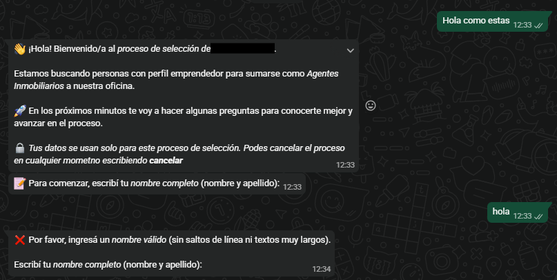 | 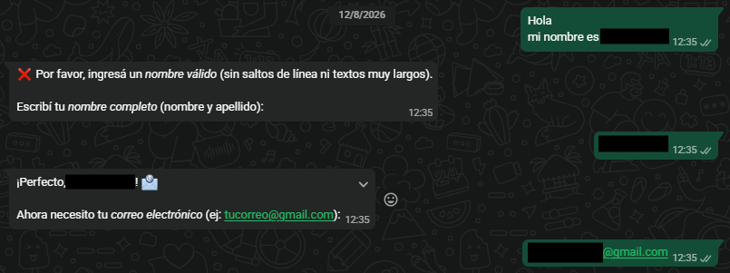 |
| 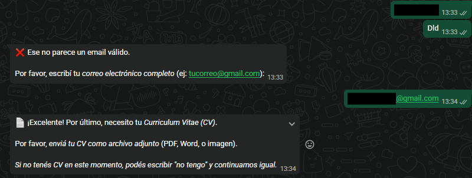 | 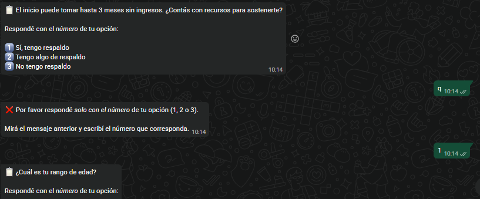 |

Cada entrada inválida (nombre con salto de línea, email mal formado,
respuesta fuera de las opciones numeradas) dispara un mensaje de error
específico y vuelve a pedir el dato — el estado no avanza hasta recibir
una respuesta válida. Ver [ADR-002](../adr/ADR-002-constrained-input-space.md).

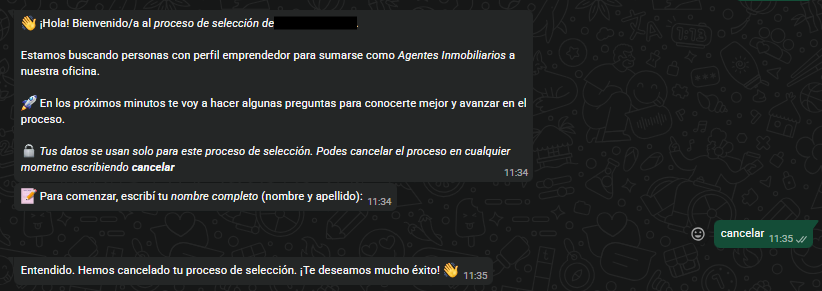

El candidato puede cancelar el proceso en cualquier momento escribiendo
"cancelar" — el flujo lo confirma y termina la conversación de forma
explícita.

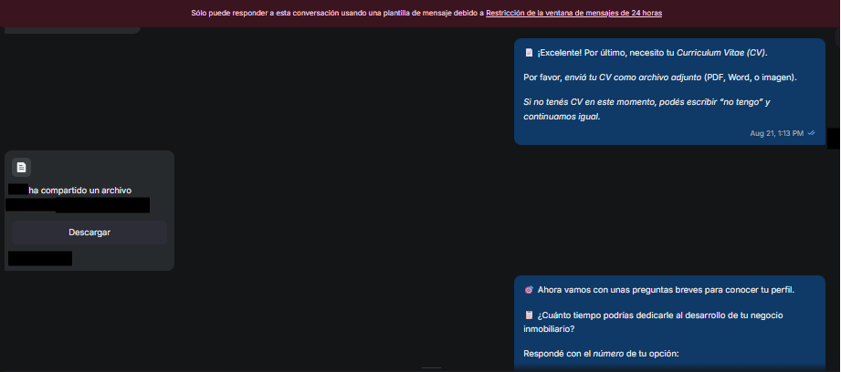

Confirmación de recepción de CV y continuidad del flujo hacia las
preguntas de calificación.

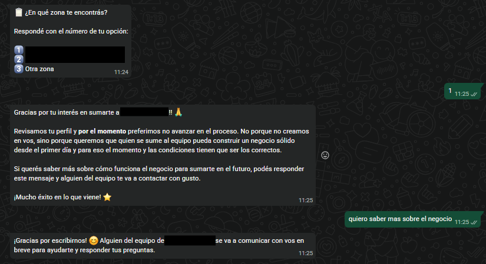

Mensaje de cierre para un candidato que no califica — sin revelar el
motivo específico inline, ver [ARCHITECTURE.md §1](../ARCHITECTURE.md#1-la-máquina-de-estados).

---

## Concurrencia — mensajes múltiples del mismo candidato

| | | |
|---|---|---|
| 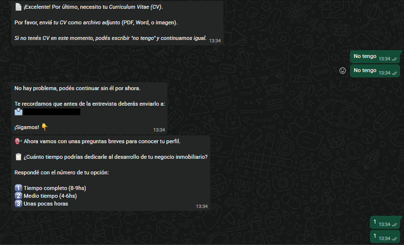 | 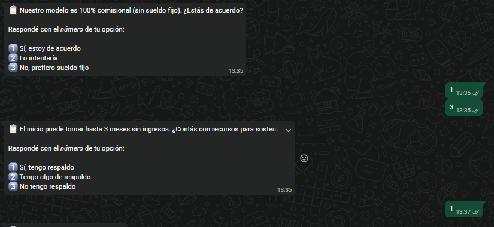 | 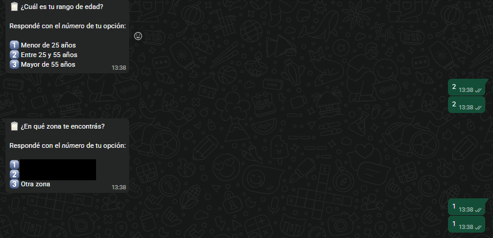 |
| 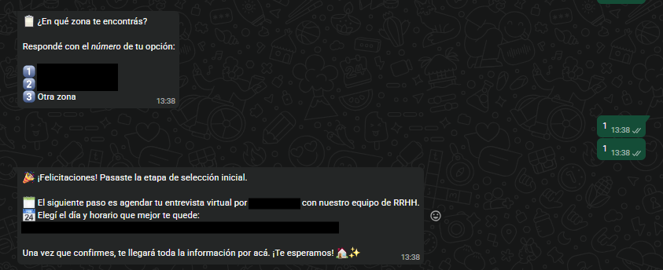 | 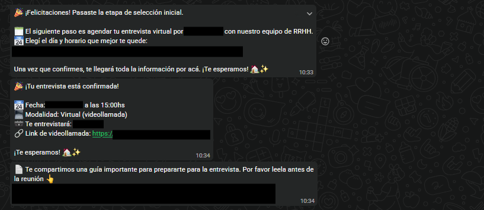 | |

Secuencia mostrando cómo el sistema maneja varios mensajes seguidos del
mismo candidato sin duplicar procesamiento ni desordenar respuestas —
resuelto por el microservicio `redis-lock`. Ver
[ADR-003](../adr/ADR-003-message-channel-robustness.md) y
[NOTES.md de redis-lock](../../services/redis-lock/NOTES.md).

---

## CRM (Odoo)

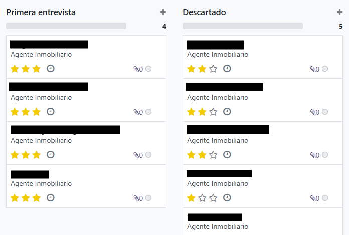

Pipeline kanban de postulantes por etapa (Primera entrevista,
Descartado, etc.).

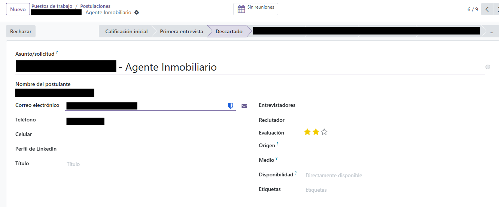

Ficha de un postulante sincronizado automáticamente desde el bot hacia
Odoo como registro `hr.applicant`.

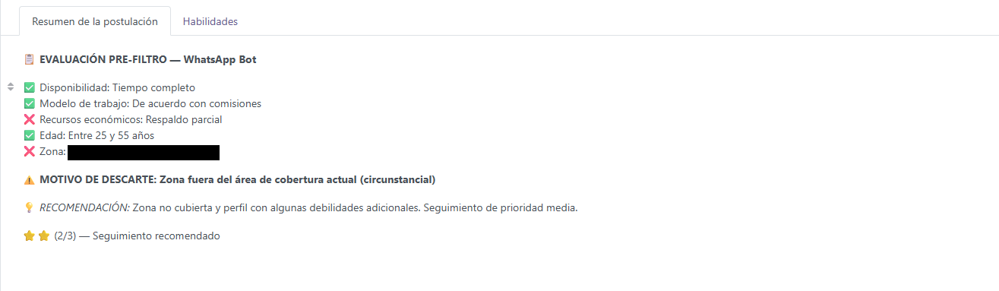

Resumen de evaluación generado automáticamente al sincronizar: qué
criterios cumplió el candidato, motivo de descarte si aplica, y una
recomendación de seguimiento con puntuación.

---

## Atención humana

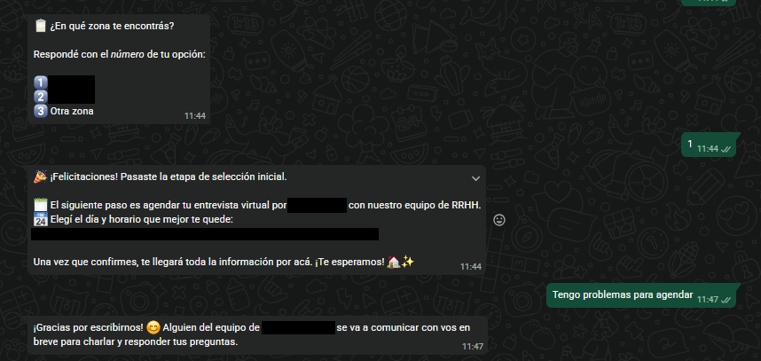

Derivación a un reclutador humano cuando el flujo no puede resolver un
caso por sí solo.

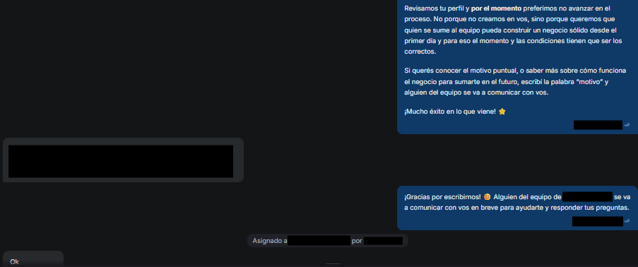

La misma conversación de descarte, vista desde la interfaz del agente
humano — muestra la asignación de la conversación al equipo de
reclutamiento.

---

## Agendamiento (Cal.com)

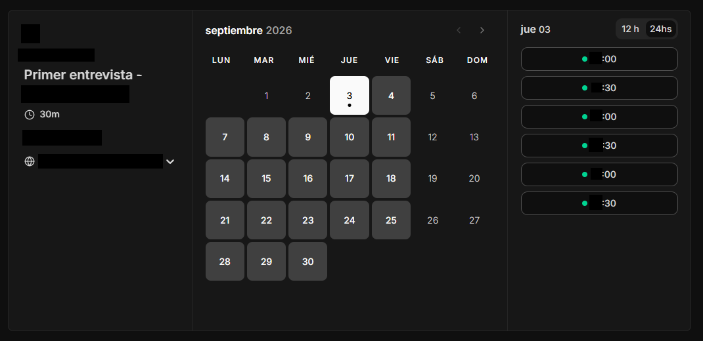

El slot reservado queda registrado en Google Calendar vía integración OAuth2
(ver [ADR-005](../adr/ADR-005-transactional-email-provider.md)).

| | |
|---|---|
| 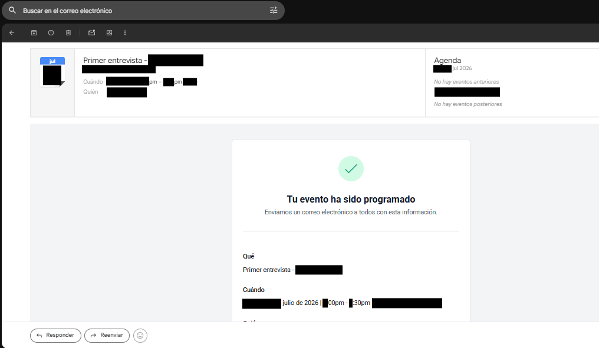 | 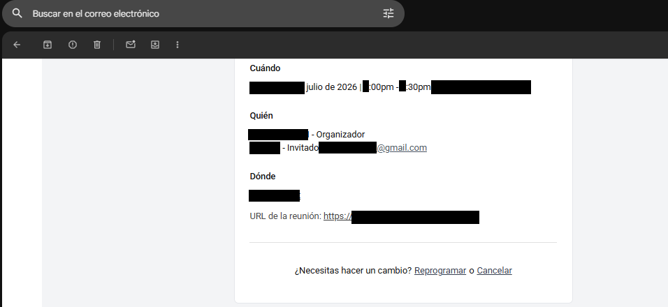 |

La invitación llega vía Google Calendar nativo (integración OAuth2 que
se mantuvo sin cambios — ver ADR-005), no por el proveedor de correo
transaccional (Resend) que maneja las notificaciones propias del bot.
Confirma que el ciclo de agendamiento se cierra de punta a punta.

---

[← Volver al README principal](../../README.md)
